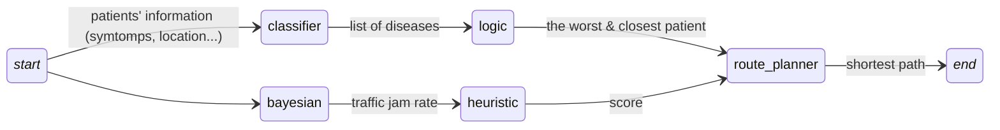

# ai-ambulance-coordinator

## Data Flow

```mermaid
stateDiagram
    direction LR
    
    *start* --> classifier: patients' information (symtomps, location...)
    classifier --> logic: list of diseases
    logic --> route_planner: the worst & closest patient
    route_planner --> *end*: shortest path
    bayesian --> heuristic: traffic jam rate
    heuristic --> route_planner: score
    *start* --> bayesian
```

## Models

- classifier: tuỳ chọn (decision tree, naive bayes...)
- logic: logic vị từ, suy diễn...
- bayesian: mạng bayes
- route_planner: dùng A*