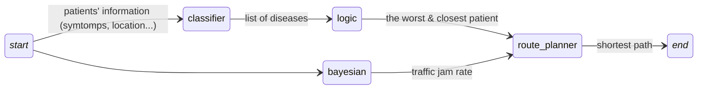

# ai-ambulance-coordinator

## Data Flow



## ⚠️ Quan trọng về skeleton code

### 1) **Ý tưởng** là tìm cách viết các module sao cho mình có thể flexible giữa việc sử dụng mô hình ***tự hiện thực*** hoặc từ  ***thư viện***.

Mọi người đọc code thì sẽ rõ hơn ý mình. Ví dụ:

```python
class MapRouter:
    def __init__(self, place_name: str = "Delhi, India", model_name: str = "simpleStreetMap"):
        self.model = MapRouter.create_map_model(place_name, model_name)     # Gọi factory method
    
    # ---------- Factory method để chọn model ----------
    @classmethod
    def create_map_model(cls, place_name: str, model_name: str):
        if model_name == "simpleStreetMap":         # Sử dụng model tự hiện thực
            from models.simple_street_graph import graph_from_place
            return graph_from_place(place_name, "drive")
        elif model_name == "osmnxStreetMap":        # Sử dụng model lấy từ thư viện
            from osmnx import graph_from_place
            return graph_from_place(place_name, network_type="drive")
```
### 2) Cấu trúc thư mục:
- Có thể hình dung trong `core/` là các module với nhiệm vụ cụ thể (dự đoán bệnh, dự đoán khả năng kẹt xe...)
- Còn trong `models/` thì là các công cụ được sử dụng bởi các module trên (classify, mạng bayes...)
    
```
|
|__modules/
|       |___core/
|       |       |__disease_classifier.py
|       |       |__map_router.py
|       |       |__traffic_estimator.py
|       |
|       |___models/
|                |__simple_classifier.py
|                |__simple_street_graph.py
|                |__simple_search_algorithm.py
|                |__simple_bayesian_network.py
|
|__ ...
```
### 3) Phân chia:
- Hoàng Anh hiện thực `disease_classifier.py` và `simple_classifier.py`
- Phương hiện thực `map_router`, `simple_street_graph.py` và `simple_search_algorithm.py`
- Khánh hiện thực `traffic_estimator.py` và `simple_bayesian_network.py`
### 4) Hợp đồng và một số gợi ý:
- ⚠️ ***HỢP ĐỒNG*** là các file thuộc `modules/core/` - skeleton mà mọi người cần tuân thủ và hiện thực, vì đây cũng chính là những gì mà mình sẽ sử dụng trực tiếp khi viết pipeline.
- `modules/models/` là nơi chứa các model tự hiện thực, ở các file mà mình đã tạo sẵn.
    
    Skeleton trong các file này là để tham khảo, không bắt buộc hiện thực theo.
    Các class/fucntion trong này sẽ chỉ được sử dụng gián tiếp thông qua các module chứ không được mình gọi trực tiếp trong pipeline.
    
    ⚠️ **Tuy nhiên** khi hiện thực thì mọi người nên bắt chước interface/signature của các thư viện mà mình muốn sử dụng thay thế.

    Ví dụ khi tự định nghĩa một classifier model:
    ```python
    class SimpleClassifier:
        def train():    # ❌ Nên đặt tên là fit()
            ...
    ```

    ❌ Method trên nên đặt tên là `fit()` vì các classifier của skit-learn cũng sử dụng hàm `fit()`
    
    Như vậy khi hiện thực `DiseaseClassifier`:
    ```python
    class DiseaseClassifier:
        def train(self, dataset_path: str):
            self.model.fit()    # Gọi fit() Không cần quan tâm self.model là instace của class nào
            ...
    ```
    ✅ Mình có thể hiện thực như trên mà không cần quan tâm `self.model` là `SimpleClassifier` hay `sklearn.tree.DecisionTreeClassifier`